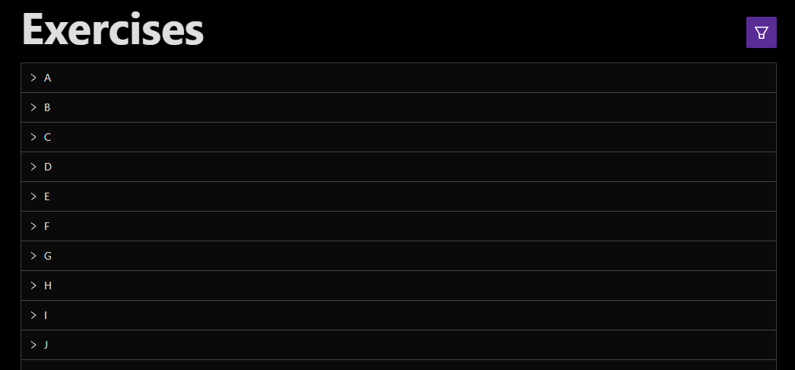
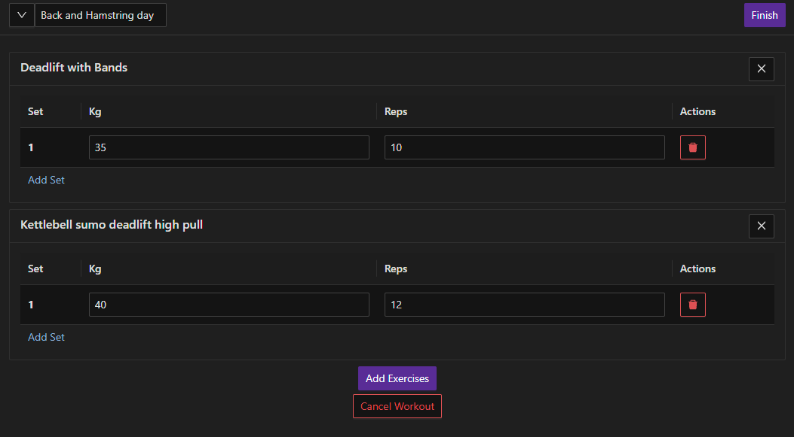

# Workout Tracker

## Description
This is an application that allow users to browse and create their favorite exercises, add them to their workout and track their progress. 

You can visit our deployed web app here: https://workout-tracker-574o.onrender.com

## Table of Contents
- [Installation](#installation)
- [Usage](#usage)
- [License](#license)
- [Contributing](#contributing)
- [Tests](#tests)
- [Questions](#questions)

## Installation
N/A

## Usage
Main features:
 - Browse and create exercises

 - Start and easily track your workout

 - View workout progress through history

 - View workout frequency

## License
This project is available under Apache 2.0 License
- For questions about forking our project and more, refer to [Questions](#questions)

## Contributing 
N/A

## Tests
N/A

## Questions
If you have any questions and need to contact me, feel free to reach out at lehonguyen00@gmail.com. 
Or visit my [Github](https://github.com/honguyen00) for more information.
